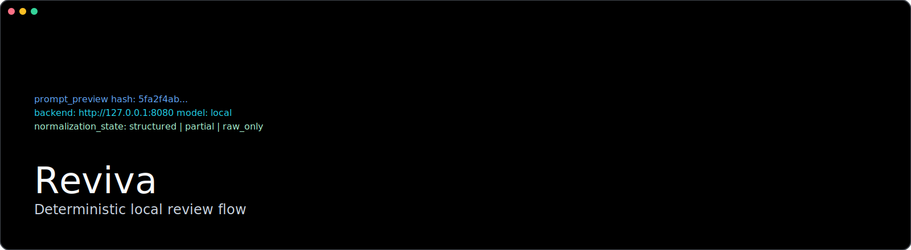

# Reviva

> Deterministic local review appliance: explicit target -> explicit prompt -> explicit artifacts.



[CLI References](./docs/cli-reference.md) | [Config References](./docs/config-reference.md)


[](https://crates.io/users/laphilosophia)


Reviva is a local-first review terminal for deterministic, inspectable, and constrained repository analysis with local LLM backends.

Reviva is intentionally narrow:

- Scan repository files
- Select an explicit review target
- Build a visible prompt for a specific review mode
- Send to a local completion backend
- Preserve raw response
- Persist findings and session artifacts

It is not a chatbot, IDE copilot, or autonomous coding agent.

## Why Reviva

Most local review flows become opaque once hidden prompt templates and agent loops are introduced.
Reviva keeps the full review path explicit and auditable.

Core principles:

- Local-first behavior
- Explicit prompt preview
- Explicit backend URL/model
- Deterministic target selection
- Plain error reporting
- Human-inspectable storage

## Install

Reviva can be installed without Rust.

### Option A: Prebuilt Binary (Recommended)

Linux/macOS:

```bash
curl -fsSL https://raw.githubusercontent.com/laphilosophia/reviva/main/scripts/install/install.sh | sh
```

Windows PowerShell:

```powershell
iwr https://raw.githubusercontent.com/laphilosophia/reviva/main/scripts/install/install.ps1 -UseBasicParsing | iex
```

You can pin a version:

```bash
REVIVA_VERSION=v0.1.0 curl -fsSL https://raw.githubusercontent.com/laphilosophia/reviva/main/scripts/install/install.sh | sh
```

```powershell
$env:REVIVA_VERSION = "v0.1.0"; iwr https://raw.githubusercontent.com/laphilosophia/reviva/main/scripts/install/install.ps1 -UseBasicParsing | iex
```

### Option B: Build From Source

1. Install Rust (stable toolchain).
2. Build:

```bash
cargo build
```

1. Run from workspace:

```bash
cargo run -p reviva -- --help
```

If installed as a binary, command name is `reviva`.

## Quick Start

1. Initialize Reviva metadata in a repository:

```bash
reviva init --repo /path/to/repo
```

1. Scan reviewable files:

```bash
reviva scan --repo /path/to/repo
```

1. Run a focused review:

```bash
reviva review \
  --repo /path/to/repo \
  --mode launch-readiness \
  --file src/main.rs
```

1. Inspect results:

```bash
reviva session list --repo /path/to/repo
reviva session show --repo /path/to/repo --id <SESSION_ID>
reviva findings list --repo /path/to/repo --session <SESSION_ID>
```

1. Export report:

```bash
reviva export --repo /path/to/repo --session <SESSION_ID> --format md
```

## Core Concepts

### Review Mode

Mode is the coarse review lens.

Built-in modes:

```text
contract
boundary
boundedness
failure-semantics
performance-risk
memory-risk
operator-correctness
launch-readiness
maintainability
```

Mode resolution order:

1. `--mode`
2. profile name if it matches a mode
3. first profile focus token that matches a mode
4. fallback: `contract`

### Review Profile

Profile is the policy layer: severity/confidence vocabulary, risk classes, optional output limits.

You can use:

- built-in profiles (`--profile NAME`)
- file-based profiles (`--profile-file PATH`)

### Prompt Wrapper

`prompt_wrapper` controls how Reviva packages the prompt before sending it to backend.

- `chatml` (default): wraps prompt in ChatML system/user blocks.
- `plain`: sends raw prompt text as-is.

Use `plain` only if your backend/model expects plain completion prompts.

### Target Selection

`review` target resolution order:

1. `--boundary-left` + `--boundary-right`
2. one or more `--file`
3. `--incremental-from <GIT_REF>`
4. interactive selection (TTY only)

In non-interactive shells, Reviva fails if no explicit target is provided.

`--incremental-from` cannot be combined with `--file` or boundary flags.
Boundary mode is deterministic: `left -> right`.

### Session and Findings

Session is canonical truth.

- `.reviva/sessions/session-*.json`: canonical records
- `.reviva/findings/*.json`: derived finding surfaces and indexes
- `.reviva/exports/*`: human-facing exports

Raw backend body is always preserved in session data even when parsing fails.

## CLI Surface

See full command reference:

- [CLI Reference](docs/cli-reference.md)

## Configuration

`reviva init` creates `.reviva/config.toml` with defaults.

See full field reference:

- [Config Reference](docs/config-reference.md)

Important behavior:

- Path-like fields are normalized to absolute paths on `init`, `scan`, and `review`.
- `llama_server_path` is kept as-is only when it is a bare command name (for example `llama-server`).
- `include`/`exclude` rules are enforced both in scan and explicit review target loading.

## llama-server Integration

Reviva can manage `llama-server` when backend is local (`127.0.0.1:8080` or `localhost:8080`).

Policies:

- `manual`
- `ensure-running`
- `ensure-running-and-stop` (default)

KV cache options:

- `--kv-cache on|off`
- `--kv-slot SLOT_ID`

## Data Layout

```text
.reviva/
  config.toml
  repo-map.json
  cache/
  sessions/
  findings/
  sets/
  exports/
```

`repo-map.json` is refreshed by `init` (unless `--no-scan`) and `scan`.

## Documentation

- [Specification](docs/spec.md)
- [Architecture](docs/architecture.md)
- [Module Boundaries](docs/module.md)
- [CLI Reference](docs/cli-reference.md)
- [Config Reference](docs/config-reference.md)
- [Roadmap](docs/roadmap.md)
- [Milestones](docs/milestones.md)

## Development

Run tests:

```bash
cargo test --all-targets
```

Format:

```bash
cargo fmt
```

## License

Apache-2.0

